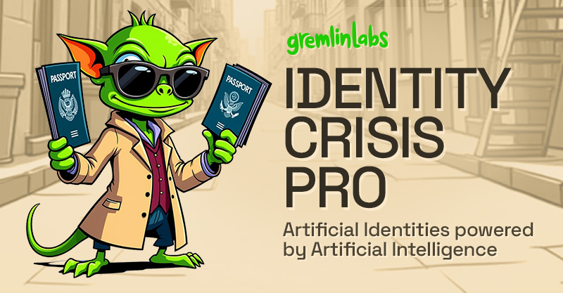

# IdentityCrisis Pro 🕵️

**Artificial Identities powered by Artificial Intelligence.**

## Mission Briefing

In the digital age, every agent needs an alter ego. Whether you're managing a fleet of social media accounts, creating test personas for your app, or just need a fresh start online, you need identities that pass scrutiny.

**IdentityCrisis Pro** is your personal agent for building and managing digital identities. Create one perfectly crafted persona or generate an entire network of agents with a single click. No gadgets required—just choose your AI handler and let the operation begin.

## Core Functionality

### Identity Generation
- **Complete Persona Creation** - Generate fully-realized digital identities with consistent details
- **AI-Powered Fields** - Create usernames, full names, addresses, bios, and passwords
- **Gender Detection** - Automatic gender detection from generated names
- **Physical Descriptions** - Detailed physical attributes for each persona

### Image Generation
- **AI Portrait Creation** - Generate realistic profile images based on physical descriptions
- **30+ Image Styles** - Choose from professional, artistic, illustrated and cultural image styles
- **Username Avatars** - Create abstract avatars based solely on username
- **Local Storage** - All generated images are stored locally for privacy and reuse

### Data Management
- **Save & Export** - Store personas locally and export in JSON format
- **Bulk Operations** - Generate multiple identities simultaneously
- **Import & Editing** - Import existing personas and edit any field
- **Search & Filter** - Easily find personas in your collection

### Privacy & Security
- **Offline Operation** - Core functionality works without internet connection
- **Local Storage** - All data remains on your device
- **API Key Management** - Securely store your API credentials locally
- **Password Generation** - Create strong, unique passwords for each identity

## Your Mission Toolkit

- 🎭 **Single Agent Deployment** - Craft one perfect identity with backstory, details, and credibility
- 👥 **Mass Operation Mode** - Generate entire networks of personas for large-scale operations
- 🤖 **Multiple Intelligence Agencies** - Choose from 8 AI providers to power your identity generation
- 🔐 **Offline Security Protocol** - Your covers stay in your vault, never transmitted
- 🌍 **Global Operations** - Windows, macOS, and Linux compatible

## Operation: Installation

### Quick Start (For Field Agents)

- Builds coming soon!

### Build Your Own Kit (For Tech Operatives)

```bash
# Secure the package
git clone https://github.com/gremlin-labs/identity-crisis-pro.git
cd identity-crisis-pro

# Install field equipment
npm install

# Test in the lab
npm run dev

# Deploy to production
npm run build
```

## Choosing Your AI Handler

Every good operative needs a handler. IdentityCrisis Pro works with the best in the business:

1. Access the control panel (settings icon, top-right) ⚙️
2. Enter your security credentials (API keys)
3. Select your preferred intelligence service

### Intelligence Services Available:

- 🎯 [OpenAI](https://platform.openai.com/api-keys) - The veteran operative
- 🎭 [Anthropic](https://console.anthropic.com/settings/keys) - The method actor
- ⚡ [Groq](https://console.groq.com/keys) - The speed specialist
- 🔮 [Google AI](https://aistudio.google.com/app/apikey) - The data analyst
- 🌟 [Mistral](https://console.mistral.ai/api-keys/) - The European connection
- 🤝 [Together.ai](https://api.together.xyz/settings/api-keys) - The team player
- 🔥 [Fireworks.ai](https://fireworks.ai/api-keys) - The demolitions expert
- 🧠 [Inference.net](https://inference.net/settings/api-keys) - The strategist

**Security Notice**: Your API credentials remain in your local vault. We don't do surveillance on our own agents.

## Field Operations

### Single Identity Generation
Perfect for that one special account that needs to be just right. Our AI handlers craft backstories, generate realistic details, and ensure your cover is airtight.

### Bulk Operations
Need to establish a presence across multiple platforms? Deploy anywhere from 25 to 500 identities in one batch. Each one unique, believable, and ready for action.

### Image Style Selection
Choose from over 30 different image styles to match your persona's backstory:
- Professional styles for business and career profiles
- Artistic styles for creative and social media personas
- Cultural styles for region-specific identities
- Specialty styles for niche communities and platforms


```bash
# Start your mission
npm run dev

# Compile your gear
npm run build

# Go live
npm start
```

## Recruitment (Contributing)

The agency is always looking for new talent. Review our [Field Manual](CONTRIBUTING.md) before applying.

1. Fork the repository (create your safe house)
2. Create your feature branch (`git checkout -b operation/codename`)
3. Commit your intel (`git commit -m 'Add covert feature'`)
4. Push to the branch (`git push origin operation/codename`)
5. Submit your mission report (Pull Request)

## The Agency Charter (License)

This operation is sanctioned under the MIT License. Even secret agents believe in open source. See [LICENSE](LICENSE) for the full dossier.


## Tech Specs (Q Branch Approved)

- [Electron](https://www.electronjs.org/) - Universal deployment framework
- [React](https://reactjs.org/) - Reactive interface construction
- [Vite](https://vitejs.dev/) - Rapid deployment engine
- [TailwindCSS](https://tailwindcss.com/) - Tactical styling system


## About The Agency

IdentityCrisis Pro is a gremlinlabs operation. We specialize in tools that are wildly useful, thoughtfully designed, and slightly dangerous in the right hands.

### The IdentityCrisis Operative's Creed

*"In the world of digital espionage, identity is currency. We mint that currency with style, substance, and just enough mystery to keep things interesting. Whether deploying one agent or an entire network, we ensure every identity could pass a background check (that we conveniently also created)."*


---

Made with 💚 mischief by gremlinlabs
